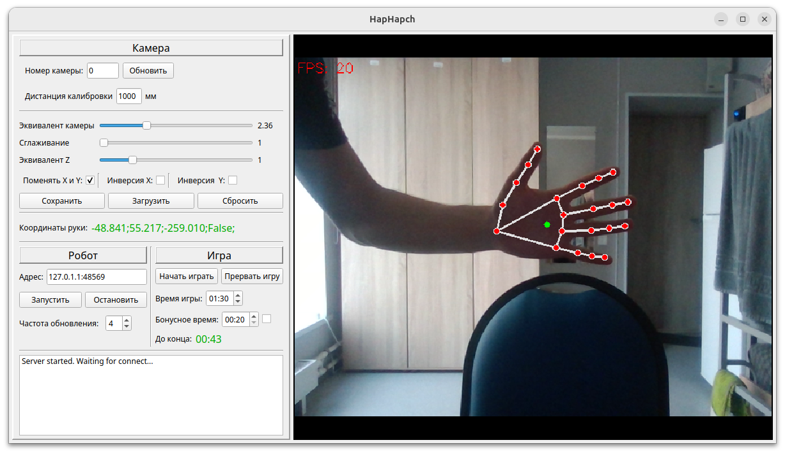
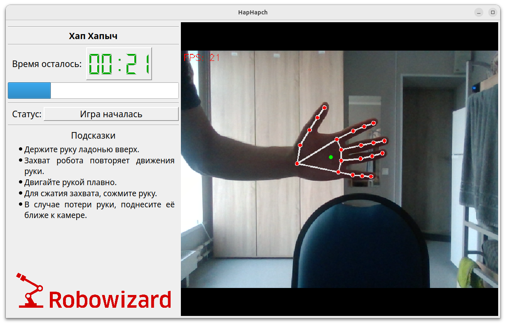

# HandTracker

Программа определяет положение руки пользователя в пространстве с помощью камеры и управляет промышленным робота Kawasaki так, чтобы тот повторял движения руки. Для определения положения руки используется нейросеть [mediapipe](https://github.com/google-ai-edge/mediapipe). 

Программа включает два интерфейса:

* Управляющий:



* Игровой:



## Пример работы


## Запуск

Скачайте репозиторий:

``` bash
git clone https://github.com/KirillHit/HandTracker.git
cd HandTracker
```

Создайте виртуальное окружение с помощью [conda](https://docs.conda.io/projects/conda/en/latest/user-guide/install/linux.html):

``` bash
conda env create -f environment.yml
conda activate handtraker
```

Запустите решение:

``` bash
python3 main.py
```

Также необходимо загрузить в робота скрипт из [этого](as/HapHapch.as) файла.
